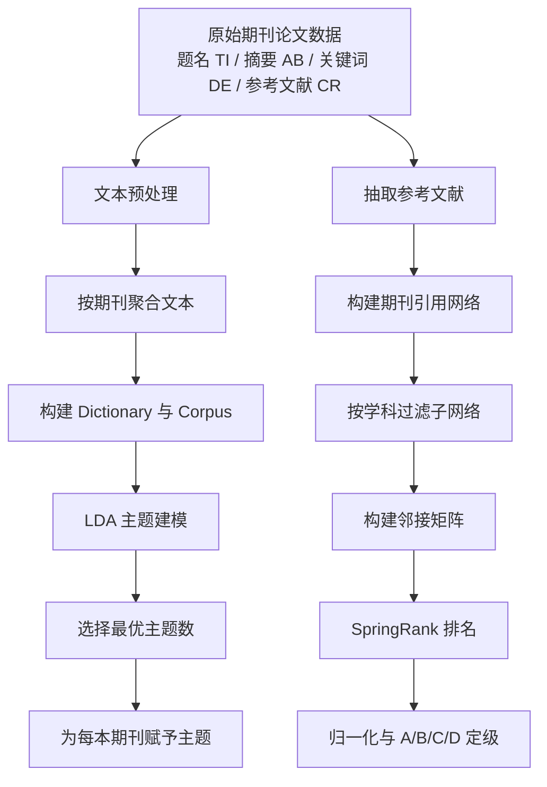

# JournalRank 项目说明文档

## 1. 项目概述

JournalRank 是一个面向特定学科期刊评价的分析项目，目标是基于近三年的期刊论文与引用数据，完成两项核心任务：

1. 对目标期刊进行主题识别与主题分类。
2. 在学科内部构建期刊引用网络，并使用 SpringRank 算法计算期刊排名与等级。

从当前仓库结构与脚本实现来看，项目已经形成了一条较完整的处理链路：

- 原始文献数据清洗与聚合
- 期刊主题建模与主题归属识别
- 参考文献抽取与引用网络构建
- 基于 SpringRank 的期刊排序
- 基于归一化分值的等级划分

当前仓库中的一次实际运行结果主要对应 FMS 期刊数据，已有中间产物与最终产物，例如：

- `R1-主题聚类结果/FMS期刊主题划分/journal_texts.csv`
- `R1-主题聚类结果/FMS期刊主题划分/dictionary.pkl`
- `R1-主题聚类结果/FMS期刊主题划分/corpus.pkl`
- `R2-期刊排名结果/FMS期刊排名及等级.xlsx`

其中，现有中间结果显示：

- 论文级清洗结果约 `335108` 条
- 聚合后的期刊文档约 `1124` 本
- 排名结果表约 `1183` 本期刊

## 2. 项目目录结构

仓库中与 JournalRank 直接相关的目录如下：

```text
JournalRank/
├─ 0-数据/
│  ├─ FMS期刊近三年数据20260308.csv
│  └─ 经济学期刊近三年数据20260308.csv
├─ 1-代码/
│  ├─ data_filter.ipynb
│  ├─ 主题识别/
│  │  ├─ data_process.py
│  │  └─ journal_topic_clustering.py
│  └─ Springrank代码/
│     ├─ get_references_springrank.py
│     ├─ build_network.py
│     ├─ ranking.py
│     ├─ ranking_withTOP.py
│     └─ py/
│        ├─ SpringRank.py
│        ├─ scores.py
│        ├─ model.py
│        └─ ...
├─ R0-processed_data/
├─ R1-主题聚类结果/
└─ R2-期刊排名结果/
```

各模块职责如下：

- `主题识别/data_process.py`：文本清洗、分词、词形还原、停用词过滤、期刊级聚合、词典与语料构建。
- `主题识别/journal_topic_clustering.py`：LDA 训练、一致性评估、最佳主题数选择、期刊主题赋值、每主题 Top-N 期刊导出。
- `Springrank代码/get_references_springrank.py`：从原始文献记录中抽取参考文献，解析参考文献年份与来源期刊。
- `Springrank代码/build_network.py`：把参考文献记录转成期刊间引用网络。
- `Springrank代码/ranking.py`：按学科构建邻接矩阵，调用 SpringRank 得到期刊分值并划分等级。
- `Springrank代码/py/SpringRank.py` 与 `py/scores.py`：SpringRank 及相关评分函数的核心实现。

## 3. 项目整体实现流程

### 3.1 流程总览



### 3.2 分阶段说明

项目可以分成四个阶段：

1. 数据预处理阶段  
   将题名、摘要、关键词合并后清洗，生成可用于主题建模的期刊级文本。

2. 主题建模阶段  
   用 LDA 在期刊文本上学习主题结构，给每本期刊赋予主导主题及其置信度。

3. 引用网络构建阶段  
   从论文参考文献中识别被引期刊与施引期刊，构建期刊之间的有向引用网络。

4. 排名与定级阶段  
   在学科内部计算 SpringRank 分值，再归一化为区间分数，最后划分为 A/B/C/D 等级。

## 4. 数据预处理实现过程

核心脚本：`1-代码/主题识别/data_process.py`

### 4.1 输入数据

脚本要求原始数据至少包含以下字段：

- `J9`：期刊缩写或期刊标识
- `TI`：题名
- `AB`：摘要
- `DE`：关键词

在脚本中，这些字段会被合并为一个原始文本字段 `raw_text`，用于后续清洗。

### 4.2 文本清洗策略

项目使用 NLTK 实现英文文本预处理，主要步骤包括：

1. 全部转为小写
2. 去除 URL、邮箱、DOI、HTML 标签
3. 用正则表达式仅保留英文字母
4. 使用 `RegexpTokenizer` 分词
5. 去除英文停用词和领域停用词
6. 对 token 做词形还原
7. 过滤过短或异常 token

其中最有项目特色的一点是：脚本内置了大量领域停用词。当前版本主要面向管理科学/FMS 期刊，因此额外过滤了大量高频但区分度弱的学术词、管理学通用词、出版词、统计词等。这一步的目的是降低“通用学术表述”对主题模型的干扰，让 LDA 更聚焦于实质研究主题。

### 4.3 期刊级文本聚合

主题建模不是直接以单篇论文为单位，而是先把同一期刊下所有论文的清洗结果聚合到一起，形成一本“期刊文档”。

这样做有两个好处：

1. 主题识别对象与最终排名对象一致，都是“期刊”而不是“论文”。
2. 聚合后文本更长，主题分布更稳定，更适合用于期刊画像。

脚本会同时统计每本期刊：

- `doc_count`：该期刊包含的论文数
- `token_total`：该期刊聚合后的总 token 数

### 4.4 词典与语料构建

聚合完成后，项目使用 `gensim.corpora.Dictionary` 构建词典，并把每本期刊文本转换成 BOW（Bag-of-Words）形式的语料 `corpus`。

输出文件包括：

- `processed_data.csv`：论文级清洗结果
- `journal_texts.csv`：期刊级聚合文本
- `dictionary.pkl`：gensim 词典
- `corpus.pkl`：BOW 语料

这几个文件共同构成了主题建模阶段的输入基础。

## 5. 主题分类实现过程

核心脚本：`1-代码/主题识别/journal_topic_clustering.py`

### 5.1 为什么选择 LDA

项目使用 LDA（Latent Dirichlet Allocation）进行主题识别，原因在于：

- LDA 适合从大规模文本中挖掘潜在主题结构。
- 每个文档可以同时属于多个主题，符合期刊内容的混合性。
- 主题结果可解释性较强，便于给期刊贴上“主题标签”。

在本项目里，一本期刊被视为一个文档，因此 LDA 学到的是“期刊层面的主题结构”。

### 5.2 LDA 的基本原理

LDA 是一种概率生成模型，其基本思想是：

1. 每篇文档由多个主题按一定比例混合生成。
2. 每个主题本身是一个词概率分布。
3. 对于文档中的每个词，先从该文档的主题分布中抽一个主题，再从该主题的词分布中抽一个词。

形式化地说：

- 文档 `d` 的主题分布记为 `theta_d`
- 主题 `k` 的词分布记为 `phi_k`
- 文档中第 `n` 个词先抽主题 `z_dn ~ Multinomial(theta_d)`
- 再抽词 `w_dn ~ Multinomial(phi_{z_dn})`

训练的目标是：根据已经观察到的词，反推出每本期刊的主题分布和每个主题的高概率词。

### 5.3 主题数选择

项目并不是预先固定主题数，而是会在一个给定范围内循环训练多个 LDA 模型，然后比较一致性分数 `c_v`。

实现方式是：

1. 指定主题数范围，如 `start_topics=60` 到 `limit_topics=60`
2. 对每个主题数训练一个 LDA 模型
3. 使用 `CoherenceModel` 计算 `c_v` 一致性分数
4. 选择一致性最高的模型作为最佳模型

这里的 `c_v` 一致性可以理解为“一个主题的高频词是否在语义上更自然地共同出现”。它不是分类准确率，但在无监督主题模型中是非常常用的模型优选指标。

### 5.4 训练实现细节

脚本支持两种训练模式：

- `LdaModel`：单核，支持 `alpha='auto'`
- `LdaMulticore`：多核，支持 `alpha='asymmetric'` 或 `alpha='symmetric'`

当前脚本默认更偏向多核训练，以提高大规模语料上的运行效率。

此外，脚本还考虑了几个实际工程问题：

- 限制 BLAS 线程数，避免多线程嵌套导致资源竞争
- 支持对训练语料采样
- 支持对一致性计算文本采样
- 支持保存最佳模型、主题词分布和训练信息

### 5.5 期刊主题赋值

在最佳模型确定后，脚本会对每本期刊计算完整主题分布，并导出以下信息：

- `dominant_topic`：主导主题编号
- `topic_confidence`：该主导主题对应的概率
- `dominant_topic_top_words`：该主题的代表词

其逻辑是：

1. 把期刊文本转为 BOW
2. 用最佳 LDA 模型得到该文档在所有主题上的概率向量
3. 选取概率最高的主题作为该期刊的主导主题

如果需要，还可以导出完整的主题分布向量，从而支持后续更细粒度的分析。

### 5.6 每主题 Top-N 期刊导出

项目还实现了“每个主题下最具有代表性的期刊”导出逻辑：

1. 对每个主题 `tid`
2. 取所有期刊在该主题上的概率
3. 按概率从高到低排序
4. 导出每个主题的 Top-N 期刊

这一步非常有用，因为它让主题结果从“抽象词簇”进一步落到“代表性期刊列表”，方便人工解释和命名主题。

## 6. 引用网络构建实现过程

核心脚本：

- `1-代码/Springrank代码/get_references_springrank.py`
- `1-代码/Springrank代码/build_network.py`

### 6.1 参考文献抽取

原始数据中通常有一列 `CR`，保存论文参考文献字符串。项目的处理方式是：

1. 删除没有参考文献的记录
2. 按分号分割参考文献字符串
3. 对每条参考文献抽取：
   - 参考文献年份
   - 参考文献期刊
   - 参考文献 DOI
4. 结合当前论文自身的信息，形成引用明细表

输出后的参考文献表通常包含：

- 当前论文题名 `TI`
- 当前论文 DOI `DI`
- 当前来源期刊 `SO`
- 当前论文年份 `PY`
- 被引期刊 `参考文献期刊`
- 被引年份 `参考文献年份`

### 6.2 时间窗口过滤

项目当前采用“参考文献与当前论文年份差不超过 3 年”的过滤逻辑，即：

`当前论文年份 - 参考文献年份 <= 3`

这样做的目的，是让期刊排名更关注“近三年的即时学术影响与互动关系”，而不是被历史上的长期累积引用完全主导。

### 6.3 引用网络定义

在 `build_network.py` 中，项目将引用关系转成期刊网络。

对每条引用，构造一条有向边：

- `SO`：施引期刊，即发表当前论文的期刊
- `RS`：被引期刊，即参考文献所属期刊

如果某期刊 A 的论文引用了期刊 B，那么网络中就有一条：

`A -> B`

这意味着边的方向表示“谁引用了谁”，边权则表示引用次数。

脚本中提供了两种网络形式：

1. `reference_network`：每一条引用单独保存一条记录
2. `citation_network`：按引用次数聚合后的加权网络

当前排名脚本主要使用前者构建邻接矩阵。

## 7. SpringRank 排名实现过程

核心脚本：

- `1-代码/Springrank代码/ranking.py`
- `1-代码/Springrank代码/py/SpringRank.py`
- `1-代码/Springrank代码/py/scores.py`

### 7.1 为什么使用 SpringRank

SpringRank 适用于有向网络中的层级排序问题。与只看被引总量不同，SpringRank 不仅考虑“被引用了多少次”，还考虑“是被谁引用的”以及“引用关系在整个网络层级中的位置”。

对于期刊评价而言，它特别适合用来回答：

- 哪些期刊位于学科引用网络的上层？
- 哪些期刊更像知识输出者？
- 哪些期刊更多处于知识吸收者位置？

### 7.2 SpringRank 的直观思想

SpringRank 可以把每个节点看作一个有“高度”的物体，把有向边看作连接节点的弹簧。

如果网络中存在一条 `i -> j` 的边，可以理解为节点 `i` 和 `j` 之间存在一个倾向于满足层级关系的约束。算法试图找到一组节点分值 `s_i`，使得整个网络的“弹簧系统能量”最小，也就是让整体层级结构尽可能自洽。

最终：

- 得分更高的节点更接近网络层级上方
- 得分更低的节点更接近网络层级下方

### 7.3 本项目中的邻接矩阵构造

对每个学科，脚本先取出该学科下的所有期刊，然后仅保留 `SO` 和 `RS` 都属于该学科期刊集合的引用记录。

随后构造邻接矩阵 `A`：

- 行表示施引期刊
- 列表示被引期刊
- `A[i,j]` 表示期刊 `i` 对期刊 `j` 的引用次数

之后，项目实际传入 SpringRank 的是 `adjacency_matrix.T`，即转置矩阵。这与脚本中注释一致：在该实现约定下，通常对 `A.T` 计算得分更符合“被引越多、地位越高”的排序直觉。

### 7.4 SpringRank 的数学形式

在 `py/SpringRank.py` 中，正则化版本的核心计算可以写成：

`(alpha * I + D_in + D_out - A - A^T) s = k_out - k_in`

其中：

- `A`：有向邻接矩阵
- `D_in`：入度对角矩阵
- `D_out`：出度对角矩阵
- `k_in`：每个节点的入度向量
- `k_out`：每个节点的出度向量
- `s`：待求的节点排名分值
- `alpha`：正则化参数

本项目在 `ranking.py` 中调用的是：

`homebrew_SpringRank_score(adjacency_matrix.T, alpha=1000)`

这说明当前实现使用了一个较大的正则化参数 `alpha=1000`，作用主要是：

- 让线性系统更稳定
- 降低网络稀疏、弱连通时的数值问题
- 使求解过程更平滑

### 7.5 本项目中的分学科排名

项目不是把所有期刊直接混排，而是默认“按学科分组计算 SpringRank”。

原因是不同学科之间的引用习惯差异较大，例如：

- 引文密度不同
- 学科规模不同
- 交叉引用模式不同

如果直接跨学科混排，结果很可能混入学科结构偏差。因此脚本先按 `DB学科` 分组，在每个学科内部单独建图、单独求解分值。

这使得输出的排名更像“学科内部相对层级”，而不是全领域绝对排序。

### 7.6 对无有效引用期刊的处理

若某学科下没有有效引用子网络，或者某些期刊完全没有进入有效网络，脚本会将这些期刊的排名值置为 `NaN`。

这样做是合理的，因为 SpringRank 依赖网络结构信息，没有进入有效网络的节点无法从关系结构中推断稳定排序。

## 8. 排名归一化与等级划分

### 8.1 归一化

由于 SpringRank 原始分值的绝对大小不便直接比较，项目在每个学科内部对非空分值做 Min-Max 归一化：

`normalized = (x - min) / (max - min)`

归一化后，所有有效分值都被映射到 `[0,1]` 区间。

特殊情况处理如下：

- 若某学科所有有效分值都相同，则统一赋值为 `0.5`
- 若某学科仅有一个有效值，也赋值为 `0.5`

这避免了极端小样本学科下出现除零问题。

### 8.2 等级划分规则

项目当前使用固定阈值将归一化得分划分为四档：

- `A`：`[0.75, 1.00]`
- `B`：`[0.50, 0.75)`
- `C`：`[0.25, 0.50)`
- `D`：`[0.00, 0.25)`

因此，当前等级不是基于分位数动态切分，而是基于固定阈值区间切分。它表达的是“在本学科网络层级中的相对位置”。

## 9. 输出结果说明

### 9.1 主题识别结果

主题识别阶段的主要输出包括：

- `coherence_results.csv`：不同主题数下的一致性分数
- `best_lda_model_*.pkl`：最佳 LDA 模型
- `topic_words_distribution.pkl`：主题词分布
- `journal_topic_assignments.csv`：期刊主题赋值结果
- `topN_docs_per_topic.csv`：各主题下代表性期刊

其中，`journal_topic_assignments.csv` 反映的是期刊的主导主题画像，而不是学科排名。

### 9.2 排名结果

当前 FMS 排名结果文件 `R2-期刊排名结果/FMS期刊排名及等级.xlsx` 的字段包括：

- 期刊基础信息：序号、学科、DB学科、ISSN、期刊名称、abbrJournal 等
- 外部等级参照：FMS 等级、JCR 排名等
- 本项目结果字段：
  - `ranking value`
  - `normalized ranking value`
  - `ranking class`

它们的含义分别是：

- `ranking value`：SpringRank 原始分值
- `normalized ranking value`：学科内归一化后的相对分值
- `ranking class`：按阈值映射得到的 A/B/C/D 等级

## 10. 项目核心算法总结

从算法层面看，JournalRank 的核心可以概括为“文本主题识别 + 网络层级排序”双主线融合。

### 10.1 主题识别主线

目标：回答“这本期刊主要在研究什么”

方法：

- 用期刊聚合文本建立 BOW 语料
- 用 LDA 学习潜在主题
- 用主导主题和主题概率刻画期刊的内容画像

输出：

- 期刊所属主题
- 各主题代表期刊

### 10.2 排名主线

目标：回答“这本期刊在学科引用网络中处于什么层级”

方法：

- 从论文参考文献中构建期刊引用有向网络
- 在学科内部建立邻接矩阵
- 用 SpringRank 求解网络层级分值
- 用归一化和阈值切分输出等级

输出：

- 期刊层级分值
- 学科内相对等级

这两条主线结合后，项目不仅能给出“排名”，还能解释“该期刊主要属于哪个研究主题”，因此比单纯的引用计数排序更有分析价值。

## 11. 项目特点与优势

### 11.1 优势

1. 主题与排名结合  
   同时刻画“研究内容”和“网络地位”，结果更立体。

2. 以期刊为建模单位  
   主题建模对象与排名对象保持一致，便于解释和应用。

3. 关注近三年引用关系  
   更强调当前学术互动，而非历史累积优势。

4. 学科内排序  
   避免不同学科之间直接混排带来的偏差。

5. 可复现性较强  
   中间文件、模型和结果文件均可独立保存。

### 11.2 当前实现的局限

1. 主题模型仍是无监督模型  
   主题标签需要结合高频词和代表期刊做人工解释。

2. 领域停用词高度依赖具体学科  
   当前版本明显针对 FMS/管理科学场景做了定制，迁移到其他领域时需要重新调整。

3. 定级规则较为简单  
   当前 A/B/C/D 是固定阈值切分，未引入更复杂的统计校准或专家规则。

4. 网络边只反映引用次数  
   尚未进一步纳入论文质量、时间衰减、跨学科权重等因素。

## 12. 复现建议

若要完整复现 JournalRank，建议按照以下顺序执行：

1. 准备近三年的原始期刊论文数据，确保包含 `J9/TI/AB/DE/CR/PY` 等字段。
2. 运行 `1-代码/主题识别/data_process.py`，生成期刊级文本与 BOW 语料。
3. 运行 `1-代码/主题识别/journal_topic_clustering.py`，得到最佳主题模型和期刊主题赋值。
4. 运行 `1-代码/Springrank代码/get_references_springrank.py`，抽取参考文献明细。
5. 运行 `1-代码/Springrank代码/build_network.py`，生成期刊引用网络。
6. 运行 `1-代码/Springrank代码/ranking.py`，输出按学科的期刊排名与等级。

## 13. 核心算法原理详解

为了让非相关领域的人员也能充分理解JournalRank项目的核心算法，本节将详细解释项目中使用的关键算法原理和相关概念。我们会用通俗易懂的语言，避免过多专业术语，并通过日常生活中的比喻来帮助理解。

### 13.1 图论基础知识：什么是网络和有向图？

在JournalRank项目中，我们经常提到“网络”和“图”，这些概念来自于数学中的图论（Graph Theory）。你可以把图想象成一张地图：

- **节点（Nodes）**：就像地图上的城市或地点。在期刊排名中，每个节点代表一本期刊。
- **边（Edges）**：就像城市之间的道路，连接不同的节点。在我们的项目中，边代表期刊之间的引用关系。

特别地，我们使用的是**有向图（Directed Graph）**。这意味着边是有方向的，就像单行道一样。如果期刊A的论文引用了期刊B的论文，那么就会有一条从A指向B的有向边，表示“A引用了B”。

引用网络就是这样一个有向图：节点是期刊，边是引用关系。这样的网络可以帮助我们理解学术界的信息流动——哪些期刊经常被其他期刊引用，哪些期刊更倾向于引用别人。

### 13.2 引用网络的概念

想象一下学术界就像一个巨大的图书馆，每本期刊都是一本书。当一本书（期刊A）的作者在写作时，需要参考其他书（期刊B）的观点或数据，这就是引用。

在JournalRank中，我们构建的引用网络就是这样的关系图：

- 如果期刊A的很多论文都引用了期刊B的论文，那么从A到B就会有很多条边（或者一条粗的边，表示引用次数多）。
- 通过这个网络，我们可以看到：
  - 哪些期刊是“知识输出者”：被很多其他期刊引用，位于网络的上游。
  - 哪些期刊是“知识吸收者”：经常引用别人，位于网络的下游。

项目为什么只关注近三年的引用？因为学术界变化很快，一本期刊五年前的影响力和现在的影响力可能完全不同。我们希望捕捉当前学术界的“实时互动”。

### 13.3 SpringRank算法：用弹簧系统理解期刊排名

SpringRank是JournalRank的核心算法。它不是简单地数“谁被引用最多”，而是考虑整个网络的结构，就像给所有期刊安排一个合理的“高度”或“层级”。

#### 直观理解：弹簧比喻

想象一下，我们把每本期刊看作一个悬挂在空中的物体，物体之间用弹簧连接：

- 如果期刊A引用了期刊B，就在A和B之间连一根弹簧。
- 弹簧的拉力会让物体们找到一个平衡位置：被引用多的期刊会被“拉”到更高的地方，成为“高层建筑”。

SpringRank算法的目标就是找到每个物体（期刊）的平衡高度，使得整个系统的“能量”最小——所有弹簧都不被过度拉伸或压缩。

#### 为什么比简单计数更好？

传统的引用计数就像只看“谁的朋友多”，但不看“朋友的质量”。SpringRank则考虑了：

- **引用者的地位**：被权威期刊引用，比被普通期刊引用更有价值。
- **网络整体结构**：算法会自动发现学术界的“层级体系”，避免某些期刊通过相互引用来“刷排名”。

#### 数学原理（简单版）

SpringRank解决的是一个优化问题：找到一组分数s₁, s₂, ..., sn（每个期刊一个分数），使得：

- 引用关系得到尊重：如果A引用B，那么A的分数应该低于B的分数（表示B在更高层级）。
- 整个网络的约束得到满足。

最终，分数高的期刊位于网络上层，分数低的位于下层。

### 13.4 LDA主题建模：如何识别期刊的研究主题？

除了排名，JournalRank还能告诉我们每本期刊主要研究什么。这部分使用的是LDA（Latent Dirichlet Allocation）算法。

#### 直观理解：主题就像菜谱

想象一下，你有一堆菜谱，每道菜都用了一些食材。LDA就像一个聪明的厨师，它能：

1. 发现隐藏的“菜系”（主题）：比如“川菜”“粤菜”。
2. 告诉每道菜属于哪个菜系，以及属于的程度。
3. 列出每个菜系的代表食材。

在期刊中：

- 每本期刊就像一道菜，由多篇文章组成。
- 文章中的词就像食材。
- LDA帮我们发现期刊在研究哪些主题，以及每个主题的关键词。

#### 为什么需要主题识别？

学术期刊往往不是只研究一个狭窄领域，而是有多个研究方向。通过主题建模，我们可以：

- 给期刊贴上“标签”：这本期刊主要研究“机器学习应用”“金融风险管理”等。
- 避免排名偏差：不同主题的期刊应该在各自领域内比较，而不是混在一起。

#### LDA的工作原理（简单版）

LDA假设每篇文档（期刊的聚合文本）都是由多个主题混合生成的：

1. 先决定这篇文档使用哪些主题，以及每个主题的比重。
2. 对文档中的每个词，从选中的主题中挑选相应的词。

训练过程就像反向工程：看到所有词后，推测出最可能的主题结构。

### 13.5 其他关键概念解释

#### BOW（Bag-of-Words）：词袋模型

想象一下，把一篇文章的所有词扔进一个袋子里，不考虑词的顺序，只数每个词出现了多少次。这就是词袋模型。

在JournalRank中，我们用BOW来表示每本期刊的文本内容：比如“机器学习”出现了10次，“数据”出现了5次等。

#### 词典（Dictionary）

就像一本字典，记录了所有在文本中出现过的词。LDA需要先建立词典，才能知道有哪些词可以使用。

#### 语料库（Corpus）

所有文档的集合。在项目中，就是所有期刊的BOW表示。

#### 邻接矩阵（Adjacency Matrix）

网络的数学表示。一个表格，行和列都代表期刊，表格中的数字表示引用关系：

- 如果第i行第j列是5，表示期刊i引用了期刊j 5次。
- 这样的矩阵可以直接输入给SpringRank算法计算。

#### 归一化（Normalization）

就像把分数从0-100分统一换算到0-1之间，便于比较。JournalRank对每个学科内的分数单独归一化，避免不同学科之间直接比较。

### 13.6 SpringRank与PageRank的区别

你可能听说过Google的PageRank算法，它们都是网络排名算法，但有重要区别：

- **PageRank**：主要用于网页排名，考虑的是“谁链接了谁”（网页间的超链接）。它假设链接是平等的，重点是网络的随机游走。
- **SpringRank**：专门为有向网络的层级排序设计，考虑引用关系的“方向性”和“层级性”。更适合学术引用这种有明确上下游关系的网络。

简单来说，PageRank问“这个网页被多少网页链接？”，SpringRank问“这个期刊在学术层级中处于什么位置？”。

### 13.7 项目整体逻辑总结

JournalRank就像给学术期刊做了一次全面体检：

1. **体检前准备**：清洗数据，提取有用信息。
2. **查体内容**：用LDA看看期刊研究什么主题。
3. **查体结构**：用引用网络看看期刊间的关系。
4. **综合诊断**：用SpringRank给出期刊在学科内的地位。
5. **分级建议**：根据分数划分A/B/C/D等级。

这样的方法让排名不仅基于数量，还基于质量和结构，让结果更公平、更可信。

## 14. 一句话总结

JournalRank 的本质，是把“期刊文本内容结构”和“期刊引用网络结构”结合起来：前者用 LDA 识别期刊主题，后者用 SpringRank 衡量期刊在学科网络中的层级位置，最终实现对特定领域期刊的分类、排序与定级。
